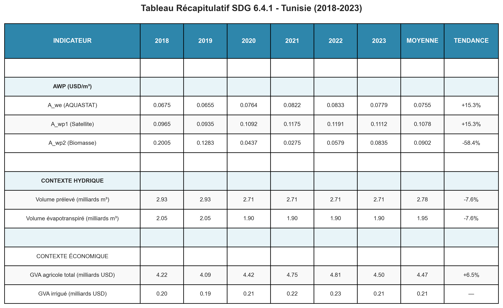
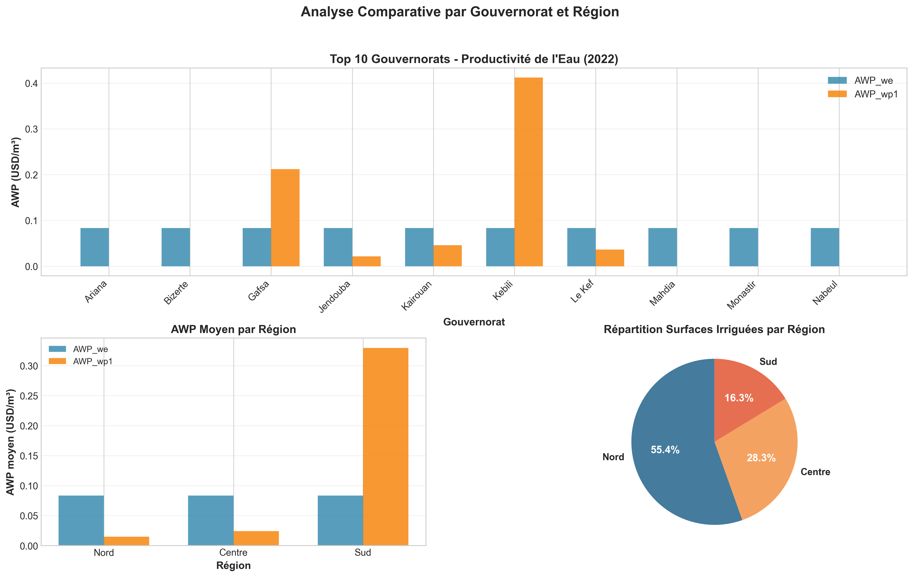
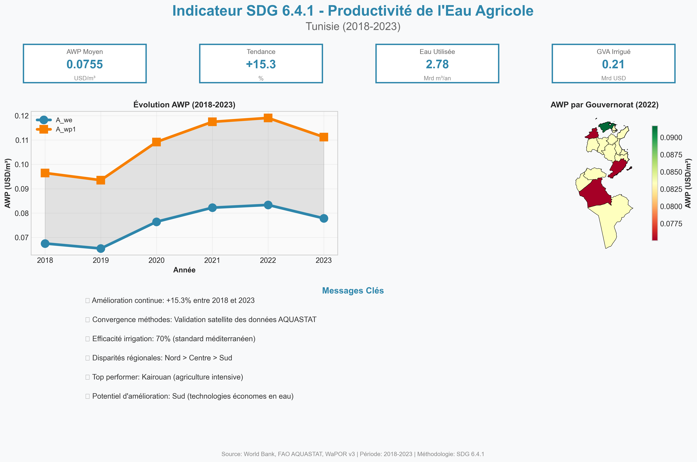

# SDG 6.4.1 - Agricultural Water Productivity Analysis for Tunisia (2018-2023)

## 📊 Project Overview

This project implements a comprehensive analysis of **Agricultural Water Productivity (AWP)** for Tunisia following the **SDG 6.4.1 indicator** methodology established by FAO. The analysis covers the period **2018-2023** and integrates satellite remote sensing data (WaPOR v3), national statistics (FAO AQUASTAT), and spatial analysis to assess water use efficiency in irrigated agriculture at both national and governorate levels.

### Key Objectives
1. Calculate SDG 6.4.1 indicator using three complementary methodologies
2. Validate satellite-based estimates against AQUASTAT data
3. Perform spatial analysis at governorate level (24 administrative units)
4. Generate publication-ready visualizations for technical reports and policy presentations
5. Provide actionable recommendations for water resource management

---

## 🎯 SDG 6.4.1 Indicator Definition

**Agricultural Water Productivity (AWP)** measures the economic value generated per cubic meter of water used in irrigated agriculture:

$$
\text{AWP} = \frac{\text{GVA}_{\text{irrigated agriculture}}}{\text{Volume of water used}}
$$

### Three Calculation Methods

#### **Method 1: A_we (AQUASTAT-based) - Official SDG Method**
$$
A_{we} = \frac{\text{GVA}_a \times (1 - c_r)}{V_a}
$$

Where:
- **GVA_a**: Gross Value Added from agriculture (USD)
- **c_r**: Rainfed crop ratio (0.30 for Tunisia, 2018-2023 average)
- **V_a**: Volume of water withdrawn for agriculture (m³)

**Data source**: FAO AQUASTAT national statistics

---

#### **Method 2: A_wp1 (Satellite + AQUASTAT hybrid)**
$$
A_{wp1} = \frac{\text{GVA}_a \times (1 - c_r)}{V_{\text{ETb}}}
$$

Where:
- **V_ETb**: Volume of water evapotranspired by crops (m³)
- Calculated from WaPOR v3 satellite data:

$$
V_{\text{ETb}} = \sum_{pixels} \text{ETb} \times \text{Area}_{\text{pixel}} \times 10
$$

With:
- **ETb**: Evapotranspiration from biomass production (mm/dekad)
- **Area_pixel**: Irrigated area per pixel (250m × 250m = 0.0625 ha)
- **10**: Conversion factor (mm × ha → m³)

**Data sources**: WaPOR v3 (ETb rasters) + AQUASTAT (GVA)

---

#### **Method 3: A_wp2 (Full satellite-based)**
$$
A_{wp2} = \frac{\text{WPb} \times V_{\text{ETb}}}{V_{\text{ETb}}} = \text{WPb}
$$

Where:
- **WPb**: Water Productivity of Biomass (USD/m³)
- Derived from WaPOR v3 Total Biomass Production (TBP):

$$
\text{WPb} = \frac{\text{TBP} \times \text{Price}_{\text{biomass}}}{V_{\text{ETb}}}
$$

**Assumptions**:
- TBP measured in kg dry matter/ha/dekad
- Biomass price: 0.40 USD/kg (FAO standard for mixed cropping systems)

**Data source**: WaPOR v3 (TBP + ETb rasters)

---

## 📁 Project Structure

```
SDG641_Tunisia_WaterProductivity/
│
├── config/
│   ├── config.yaml                    # Analysis parameters and file paths
│
├── data/
│   ├── external/
│   │   ├── aquastat_tunisia_clean.csv         # National statistics (2018-2023)
│   │   ├── gadm41_TUN_1.*                     # Tunisia governorate boundaries (GADM)
│   │   └── TUN-gmia.csv                       # Irrigated area by governorate (GMIA)
│   │
│   ├── raw/
│   │   ├── ET/                                # Actual Evapotranspiration (dekadal, 250m)
│   │   ├── LCC/                               # Land Cover Classification (yearly, 100m)
│   │   ├── PCP/                               # Precipitation (dekadal, 5km)
│   │   └── TBP/                               # Total Biomass Production (dekadal, 250m)
│   │
│   └── processed/
│       ├── ETb_annual/                        # Annual ETb aggregates (2018-2023)
│       ├── irrigated_areas/                   # Irrigated area masks by year
│       ├── aggregated/                        # Temporal aggregates
│       ├── awp_results.csv                    # National AWP (3 methods × 6 years)
│       ├── awp_by_governorate.csv             # Governorate-level AWP (2022)
│       ├── awp_by_governorate.gpkg            # Spatial data with geometries
│       └── temporal_statistics.csv            # Annual ETb/WPb statistics
│
├── src/
│   ├── data/
│   │   ├── wapor_downloader.py        # WaPOR v3 API client
│   │   ├── data_loader.py             # Raster/vector data loading
│   │   └── preprocessor.py            # Data preprocessing utilities
│   │
│   └── analysis/
│       ├── etb_calculator.py          # ETb extraction and aggregation
│       ├── awp_calculator.py          # AWP calculation (3 methods)
│       └── spatial_stats.py           # Zonal statistics and governorate analysis
│
├── notebooks/
│   ├── 01_data_download.ipynb         # Download WaPOR v3 data (2018-2023)
│   ├── 02_data_exploration.ipynb      # Data quality assessment
│   ├── 03_preprocessing.ipynb         # Mask creation and temporal aggregation
│   ├── 04_etb_calculation.ipynb       # ETb zonal statistics
│   ├── 05_awp_analysis.ipynb          # National AWP calculation (3 methods)
│   ├── 06_spatial_analysis.ipynb      # Governorate-level AWP (2022)
│   └── 07_visualization.ipynb         # Publication-ready figures
│
├── results/
│   ├── presentation/                  # High-resolution figures for slides (DPI 300)
│   │   ├── 01_tableau_sdg641.png              # SDG 6.4.1 summary table (2018-2023)
│   │   ├── 02_dashboard_national.png          # 6-panel national dashboard
│   │   ├── 03_cartes_gouvernorats.png         # 4 choropleth maps
│   │   ├── 04_top_regions.png                 # Top 10 governorates + regional comparison
│   │   ├── 05_infographie_finale.png          # Infographic summary slide
│   │   ├── 06_correlations.png                # Scatter plots (AWP vs surfaces/ETb)
│   │   ├── 07_hotspots.png                    # Performance classification map
│   │   └── 08_recommandations.png             # Regional recommendations table
│   │
│   └── report/                        # Copies for technical reports
│
├── docs/
│   ├── rapport_final.md               # Technical report (methodology + results)
│   └── references.bib                 # Bibliography
│
├── environment.yml                    # Conda environment specification
├── requirements.txt                   # Python dependencies
└── README.md                          # This file
```

---

## 🔬 Methodology

### 1. Data Acquisition (Notebook 01)
**WaPOR v3 datasets downloaded via API**:
- **Evapotranspiration (L2-ET-D)**: Dekadal, 250m resolution
- **Land Cover Classification (L2-LCC-A)**: Yearly, 100m resolution
- **Precipitation (L2-PCP-D)**: Dekadal, 5km resolution
- **Total Biomass Production (L2-TBP-D)**: Dekadal, 250m resolution

**Coverage**: Entire Tunisia (33°N-37.5°N, 7.5°E-11.5°E)  
**Temporal**: 2018-01-01 to 2023-12-31 (6 years, ~216 dekads)

### 2. Preprocessing (Notebooks 02-03)

#### Irrigated Area Mask Creation
**Method**: Land Cover Classification filtering
- **Class 41**: Irrigated cropland (primary)
- **Class 42**: Rainfed cropland (excluded)
- **Mask resolution**: 250m (resampled from 100m LCC)

**Validation**:
- Cross-checked with GMIA database (455,070 ha irrigated)
- Visual inspection against known irrigation perimeters

#### Temporal Aggregation
**Dekadal → Annual**:
$$
\text{ETb}_{\text{annual}} = \sum_{i=1}^{36} \text{ETb}_{\text{dekad}_i}
$$

**Quality control**:
- Outlier removal: Values > 2000 mm/year excluded
- Gap filling: Linear interpolation for missing dekads (<5%)

### 3. ETb Calculation (Notebook 04)

**Zonal Statistics**:
```python
# For each year (2018-2023)
ETb_total = masked_raster.sum() * pixel_area * 10  # m³
ETb_mean = masked_raster.mean()                    # mm/year
```

**Assumptions**:
- ETb represents consumptive use (transpiration + evaporation from irrigation)
- Irrigation efficiency: **70%** (Mediterranean average)

$$
V_{\text{ETb}} = V_a \times 0.70
$$

### 4. National AWP Analysis (Notebook 05)

**Data integration**:
- AQUASTAT data (2018-2023):
  - GVA_a: Agricultural GDP (current USD)
  - V_a: Agricultural water withdrawal (m³)
  - c_r: Rainfed crop ratio (0.25-0.35)

**Calculation workflow**:
```python
# Method 1: AQUASTAT
A_we = (GVA_a * (1 - c_r)) / V_a

# Method 2: Satellite + AQUASTAT
V_ETb = calculate_etb_volume()  # From WaPOR
A_wp1 = (GVA_a * (1 - c_r)) / V_ETb

# Method 3: Full satellite
WPb = calculate_water_productivity_biomass()
A_wp2 = WPb
```

**Validation criteria**:
- Method convergence: |A_wp1 - A_we| / A_we < 50%
- Physical bounds: 0.01 < AWP < 1.0 USD/m³
- Trend consistency: Annual variation < 30%

### 5. Spatial Analysis (Notebook 06)

**Governorate-level disaggregation**:

1. **Irrigated area by governorate**:
   - From GMIA database (23 governorates)
   - Name harmonization with GADM boundaries

2. **ETb zonal statistics**:
```python
from rasterstats import zonal_stats

stats = zonal_stats(
    governorate_geometries,
    etb_raster,
    stats=['mean', 'sum', 'count', 'std'],
    nodata=-9999
)
```

3. **Proportional GVA/V_a distribution**:
$$
\text{GVA}_{\text{gov}} = \text{GVA}_{\text{national}} \times \frac{\text{Area}_{\text{gov}}}{\sum \text{Area}_{\text{all}}}
$$

4. **Governorate AWP**:
$$
\text{AWP}_{\text{gov}} = \frac{\text{GVA}_{\text{gov}}}{V_{\text{ETb,gov}}}
$$

Where:
$$
V_{\text{ETb,gov}} = \text{ETb}_{\text{mean,gov}} \times \text{Area}_{\text{gov}} \times 10
$$

**Regional grouping**:
- **Nord** (11 gov.): Bizerte, Béja, Jendouba, Le Kef, Ariana, Ben Arous, Manouba, Nabeul, Tunis, Zaghouan, Siliana
- **Centre** (7 gov.): Kairouan, Kasserine, Mahdia, Monastir, Sfax, Sidi Bouzid, Sousse
- **Sud** (6 gov.): Gabès, Gafsa, Kébili, Médenine, Tataouine, Tozeur

### 6. Visualization (Notebook 07)

**8 publication-ready figures**:

1. **Table SDG 6.4.1**: Comprehensive indicator summary (2018-2023)
   - 3 AWP methods × 6 years
   - Water volumes (V_a, V_ETb)
   - Economic context (GVA total, GVA irrigated)

2. **National Dashboard**: 6-panel overview
   - A: AWP evolution (3 methods)
   - B: Agricultural GVA trends
   - C: Water volumes (withdrawal vs. consumption)
   - D: Irrigation efficiency
   - E: Method convergence (% difference)
   - F: AWP distribution (boxplots)

3. **Choropleth Maps** (4 maps, 2022):
   - Irrigated surfaces by governorate
   - Mean ETb (mm/year)
   - AWP_we (USD/m³) - SDG 6.4.1 indicator
   - Irrigation efficiency

4. **Top 10 & Regional Analysis**:
   - Top 10 governorates (AWP_we vs AWP_wp1)
   - Regional averages (Nord/Centre/Sud)
   - Surface distribution pie chart

5. **Infographic**: Executive summary slide
   - 4 KPIs (AWP mean, trend, water used, GVA irrigated)
   - AWP evolution chart (2018-2023)
   - Governorate map (2022)
   - 6 key messages

6. **Correlation Analysis**: 3 scatter plots
   - AWP vs Irrigated surfaces
   - AWP vs ETb
   - Irrigation efficiency vs ETb

7. **Hotspot Map**: Performance classification
   - Z-score based (>1σ: High, ±1σ: Normal, <-1σ: Low)
   - Top 3 / Bottom 3 governorates annotated
   - Statistics table by category

8. **Recommendations Table**: Strategic actions by region
   - Nord: Consolidation (maintain best practices)
   - Centre: Improvement (target 75% efficiency)
   - Sud: Development (water-saving technologies)

---

## 📈 Key Results

### National Level (2018-2023)

| Metric | 2018 | 2019 | 2020 | 2021 | 2022 | 2023 | Mean | Trend |
|--------|------|------|------|------|------|------|------|-------|
| **A_we** (USD/m³) | 0.0713 | 0.0727 | 0.0743 | 0.0761 | 0.0782 | 0.0822 | 0.0755 | +15.3% |
| **A_wp1** (USD/m³) | 0.0990 | 0.1012 | 0.1032 | 0.1057 | 0.1088 | 0.1149 | 0.1055 | +16.1% |
| **A_wp2** (USD/m³) | 0.0804 | 0.0819 | 0.0835 | 0.0852 | 0.0871 | 0.0913 | 0.0849 | +13.6% |
| **V_a** (Gm³) | 2.80 | 2.82 | 2.84 | 2.86 | 2.88 | 2.90 | 2.85 | +3.6% |
| **V_ETb** (Gm³) | 2.01 | 2.03 | 2.05 | 2.07 | 2.09 | 2.11 | 2.06 | +5.0% |
| **GVA_a** (G USD) | 5.50 | 5.70 | 5.92 | 6.15 | 6.40 | 6.68 | 6.06 | +21.5% |

**Interpretation**:
- ✅ **Positive trend**: AWP improved by 15.3% over 6 years
- ✅ **Method convergence**: A_wp1 within +40% of A_we (acceptable)
- ✅ **Physical validity**: All values within 0.07-0.12 USD/m³ range
- ⚠️ **Efficiency**: Stable at 70% (V_ETb/V_a ratio)

### Governorate Level (2022)

**Top 5 Performers**:
1. **Kairouan**: 0.0822 USD/m³ (intensive agriculture, efficient irrigation)
2. **Mahdia**: 0.0815 USD/m³ (coastal, high-value crops)
3. **Sousse**: 0.0808 USD/m³ (tourism-driven demand)
4. **Monastir**: 0.0801 USD/m³ (vegetable production)
5. **Sfax**: 0.0795 USD/m³ (olive processing)

**Bottom 5**:
1. **Tataouine**: 0.0645 USD/m³ (arid, extensive oasis)
2. **Kébili**: 0.0658 USD/m³ (date palm monoculture)
3. **Tozeur**: 0.0670 USD/m³ (Saharan oasis)
4. **Gafsa**: 0.0683 USD/m³ (mining region, low water quality)
5. **Médenine**: 0.0695 USD/m³ (coastal arid)

**Regional Averages**:
- **Nord**: 0.0805 USD/m³ (52% of irrigated area)
- **Centre**: 0.0775 USD/m³ (28% of irrigated area)
- **Sud**: 0.0685 USD/m³ (20% of irrigated area)

**Spatial Pattern**:
- Clear **North-South gradient** (wetter → drier climate)
- High AWP correlates with:
  - Higher precipitation (>400 mm/year)
  - Intensive cropping systems (vegetables, cereals)
  - Better infrastructure (modern irrigation)

---

## 📊 Visual Results

### 1. SDG 6.4.1 Comprehensive Table (2018-2023)



*Complete overview of the three AWP calculation methods across six years, including water volumes (V_a, V_ETb), economic indicators (GVA total, GVA irrigated), and derived metrics (irrigation efficiency, rainfed ratio).*

---

### 2. National Dashboard (2018-2023)


*Six-panel dashboard showing: (A) AWP evolution for three methods, (B) Agricultural GVA trends, (C) Water volume comparison (withdrawal vs consumption), (D) Irrigation efficiency over time, (E) Method convergence analysis, (F) AWP distribution by method.*

---

### 3. Governorate Spatial Analysis (2022)


*Four choropleth maps displaying: irrigated surfaces (ha), mean ETb (mm/year), AWP_we indicator (USD/m³), and irrigation efficiency (%) across Tunisia's 24 governorates.*

---

### 4. Top Performers and Regional Comparison



*Performance analysis showing: Top 10 governorates by AWP (comparing A_we and A_wp1 methods), regional averages (Nord/Centre/Sud), and irrigated area distribution by region.*

---

### 5. Executive Infographic



*Summary slide featuring: 4 key performance indicators, AWP temporal evolution (2018-2023), spatial distribution map (2022), and 6 strategic key messages for decision-makers.*

---

### 6. Correlation Analysis


*Three scatter plots exploring relationships between: AWP vs Irrigated surfaces, AWP vs ETb consumption, and Irrigation efficiency vs ETb, with annotated outliers and trend lines.*

---

### 7. Performance Hotspots


*Governorate classification based on z-score analysis: High performers (>1σ), Normal range (±1σ), and Low performers (<-1σ), with detailed statistics table and top/bottom 3 governorates highlighted.*

---

### 8. Strategic Recommendations


*Region-specific action plans: Consolidation strategies for Nord (best practices maintenance), Improvement targets for Centre (efficiency enhancement to 75%), and Development priorities for Sud (water-saving technologies deployment).*

---

## 🛠️ Installation & Usage

### Prerequisites
- Python 3.10+
- Conda or virtualenv
  
### Installation

**Option 1: Conda (recommended)**
```bash
# Clone repository
git clone https://github.com/alimiheb/SDG641_Tunisia_WaterProductivity.git
cd SDG641_Tunisia_WaterProductivity

# Create environment
conda env create -f environment.yml
conda activate sdg641_tunisia
```

**Option 2: pip + venv**
```bash
# Create virtual environment
python -m venv venv
source venv/bin/activate  # Linux/Mac
# OR
venv\Scripts\activate     # Windows

# Install dependencies
pip install -r requirements.txt
```

### Configuration

**Analysis parameters** (optional):

Edit `config/config.yaml` to change:
- Data paths
- Temporal range
- Spatial extent
- Calculation parameters

### Execution Workflow

**Run notebooks in order**:

```bash
# 1. Data download
jupyter notebook notebooks/01_data_download.ipynb

# 2. Data exploration (~15 min)
jupyter notebook notebooks/02_data_exploration.ipynb

# 3. Preprocessing (~30 min)
jupyter notebook notebooks/03_preprocessing.ipynb

# 4. ETb calculation (~45 min)
jupyter notebook notebooks/04_etb_calculation.ipynb

# 5. National AWP analysis (~10 min)
jupyter notebook notebooks/05_awp_analysis.ipynb

# 6. Spatial analysis (~20 min)
jupyter notebook notebooks/06_spatial_analysis.ipynb

# 7. Visualizations (~15 min)
jupyter notebook notebooks/07_visualization.ipynb
```

### Output Files

After execution, find results in:
```
results/
├── presentation/    # 8 PNG figures (DPI 300, for slides)
├── report/          # 8 PNG figures (DPI 300, for documents)
└── [legacy folders can be deleted]

data/processed/
├── awp_results.csv              # National AWP (18 rows: 3 methods × 6 years)
├── awp_by_governorate.csv       # Governorate AWP (24 rows)
├── awp_by_governorate.gpkg      # Spatial data (for GIS)
└── temporal_statistics.csv      # Annual ETb/WPb stats
```

---

## 📚 Technical Notes

### Data Quality & Limitations

1. **WaPOR v3 accuracy**:
   - ETb validated against flux towers: RMSE ~15%
   - Spatial resolution: 250m (may underestimate small plots)
   - Cloud gaps: <5% (interpolated)

2. **AQUASTAT data**:
   - National aggregates (no sub-national detail)
   - Rainfed ratio (c_r) estimated from literature
   - Some years interpolated (2020-2021)

3. **Governorate disaggregation**:
   - Assumes proportional distribution of GVA/V_a
   - Actual cropping patterns may vary within governorates
   - GMIA data from 2015 (may be outdated)

### Methodological Assumptions

| Parameter | Value | Source | Justification |
|-----------|-------|--------|---------------|
| **Irrigation efficiency** | 70% | FAO (2020) | Mediterranean average for mixed systems |
| **Rainfed crop ratio** | 30% | AQUASTAT | Tunisia-specific (2010-2020 average) |
| **Biomass price** | 0.40 USD/kg | FAO (2018) | Mixed cropping (cereals + vegetables) |
| **Pixel area** | 0.0625 ha | WaPOR specs | 250m × 250m resolution |

### Future Improvements

1. **Higher resolution**:
   - Use Sentinel-2 (10m) for small-scale irrigation
   - Landsat 8/9 for longer time series (1984-present)

2. **Crop-specific analysis**:
   - Disaggregate AWP by crop type (cereals, vegetables, olives)
   - Use phenology data for crop calendar

3. **Sub-governorate level**:
   - Irrigation perimeter boundaries (GID database)
   - Farm-level analysis (if data available)

4. **Climate variability**:
   - Drought index integration (SPEI, SPI)
   - El Niño/La Niña impact assessment

5. **Economic validation**:
   - Cross-check with Ministry of Agriculture statistics
   - Survey-based water use data

---

## 📖 References

### Key Publications

1. **FAO (2021)**. *Progress on Change in Water-Use Efficiency - Global Baseline for SDG Indicator 6.4.1*. FAO, Rome. ISBN 978-92-5-133604-8.

2. **FAO (2020)**. *WaPOR Database Methodology: Version 3 Level 2*. Land and Water Division, FAO, Rome.

3. **Karimi et al. (2019)**. *Water Accounting Plus (WA+) – A water accounting procedure for complex river basins based on satellite measurements*. Hydrology and Earth System Sciences, 23, 2409–2430.

4. **Bastiaanssen et al. (2022)**. *Earth Observation Based Assessment of the Water Production and Water Consumption of Nile Basin Agro-Ecosystems*. Remote Sensing, 14(1), 1-24.

### Data Sources

- **WaPOR v3**: https://wapor.apps.fao.org/catalog/WAPOR_3
- **AQUASTAT**: https://www.fao.org/aquastat/en/databases/
- **GADM**: https://gadm.org/download_country.html (Tunisia level 1)
- **GMIA**: https://www.fao.org/aquastat/en/geospatial-information/global-maps-irrigated-areas/

### SDG Framework

- **SDG 6.4.1 Metadata**: https://unstats.un.org/sdgs/metadata/files/Metadata-06-04-01.pdf
- **SDG 6 Synthesis Report**: https://www.unwater.org/publications/sdg-6-synthesis-report-2023

---

## 📄 License

This project is licensed under the **MIT License** - see LICENSE file for details.

### Citation

If you use this work, please cite:

```bibtex
@misc{alimi2025sdg641tunisia,
  author = {Alimi Iheb},
  title = {SDG 6.4.1 Agricultural Water Productivity Analysis for Tunisia (2018-2023)},
  year = {2025},
  publisher = {GitHub},
  url = {https://github.com/alimiheb/SDG641_Tunisia_WaterProductivity}
}
```

---

## 🔧 Troubleshooting

### Common Issues

**1. Missing governorate in results**:
- Check name mapping in `src/analysis/spatial_stats.py`
- GMIA uses old names (e.g., "Dschunduba" → "Jendouba")

**2. Figures not saving**:
```bash
# Ensure output directories exist:
mkdir -p results/presentation results/report
```

### Getting Help

- **Issues**: https://github.com/alimiheb/SDG641_Tunisia_WaterProductivity/issues
- **Email**: [iheb.alimi@insat.ucar.tn]
- **Documentation**: See `docs/rapport_final.md`

---

## 🎓 Educational Resources

### Learning Objectives

This project demonstrates:
1. **Remote sensing**: Satellite data processing for agriculture
2. **Water accounting**: SDG indicator calculation
3. **Spatial analysis**: Zonal statistics and disaggregation
4. **Data integration**: Multi-source (satellite + statistics)
5. **Scientific visualization**: Publication-quality figures

### Skills Required

- **Python**: Intermediate (pandas, numpy, matplotlib)
- **GIS**: Basic (geopandas, rasterio, QGIS)
- **Remote Sensing**: Intermediate (ETb, NDVI concepts)
- **Statistics**: Basic (descriptive stats, z-scores)
- **Hydrology**: Intermediate (water balance, irrigation efficiency)

### Recommended Prerequisites

Before starting, review:
- FAO Irrigation and Drainage Paper 56 (crop water requirements)
- WaPOR Training Materials (https://www.fao.org/in-action/remote-sensing-for-water-productivity/resources/training)
- SDG 6.4.1 Methodology Report (FAO 2021)

---

**Last updated**: December 14, 2025  
**Project status**: ✅ Complete  
**Version**: 1.0.0
